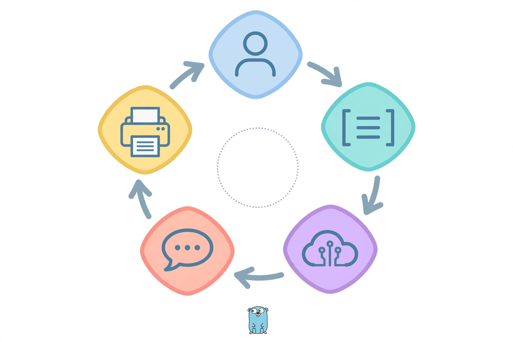
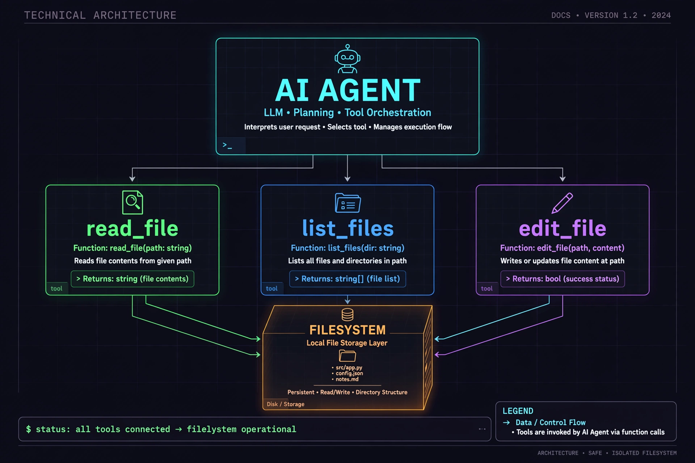
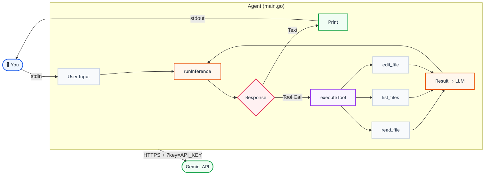

# Code-Editing Agent — Go-Powered AI Coding Assistant


> A fully functional terminal-based AI agent built in Go that can read, list, and edit files on your filesystem — powered by Google Gemini (OpenAI-compatible API) with tool-calling capabilities.

This project is a real-world implementation of an **autonomous AI code-editing agent** that runs in your terminal. It demonstrates the core concepts of LLM tool calling, conversation management, and filesystem interaction — all in ~300 lines of Go.

---

## 📋 Table of Contents

- [Project Overview](#project-overview)
- [Architecture](#architecture)
- [Technical Concepts & Terminology](#technical-concepts--terminology)
- [Tools Implemented](#tools-implemented)
- [Installation & Setup](#installation--setup)
- [Usage Examples](#usage-examples)
- [Output Examples](#output-examples)
- [The Guide: Building a Code-Editing Agent from Scratch](#the-guide-building-a-code-editing-agent-from-scratch)
- [Key Takeaways](#key-takeaways)

---

## Project Overview

This project implements a **code-editing agent** — an AI-powered assistant that can interact with your local filesystem through natural language conversation. The agent:

1. Takes user input via the terminal
2. Sends conversational context to an LLM (Google Gemini)
3. Detects when the LLM wants to use a **tool** (read/list/edit files)
4. Executes the tool on the local filesystem
5. Returns the results back to the LLM for further reasoning
6. Repeats until the task is complete

### Original Source

This project is based on the guide **"How to Build a Code-Editing Agent from Scratch in Go"** (see `code-editing-agent-guide.md`), which originally used the Anthropic Claude SDK. This version has been adapted to use Google Gemini's OpenAI-compatible endpoint with the `go-openai` library.

> **Original Article**: [https://ampcode.com/notes/how-to-build-an-agent](https://ampcode.com/notes/how-to-build-an-agent)

---

## Architecture



### Core Loop Flow

```
readUserInput → append user message → runInference(tools) → check tool_use → executeTool → append tool_result → loop
```

### Architecture Components



### High-Level Architecture Diagram



> **Note**: This diagram uses Mermaid. GitHub renders it natively. For other viewers, use the [Mermaid Live Editor](https://mermaid.live/).

> **Key Design Insight**: The server (Gemini) is **stateless**. It only sees what's in the conversation slice. It's up to the client to maintain the conversation history across turns.

---

## Technical Concepts & Terminology

### 1. 🧠 LLM (Large Language Model)
The AI model that powers the agent. In this project, we use **Google Gemini 2.5 Flash Lite** via its OpenAI-compatible API endpoint. The LLM handles natural language understanding, reasoning, and decides when to call tools.

### 2. 🛠️ Tool Calling (Function Calling)
The core mechanism that enables the LLM to interact with the outside world. The LLM doesn't execute code directly — instead it **requests** that a tool be executed by returning a structured response. The agent then performs the actual execution and returns the result.

**How it works:**
1. Agent sends tool definitions (name, description, input schema) alongside the conversation
2. LLM decides when to use a tool based on the user's request
3. LLM responds with a `tool_use` content block containing the tool name and arguments
4. Agent executes the tool locally
5. Agent sends the tool result back to the LLM
6. LLM continues reasoning with the new information

### 3. 🔄 Conversation Context Window
The LLM has a limited "context window" — the maximum amount of text it can process at once. The agent maintains the conversation history as a growing slice of messages, sending the entire history with each request. This preserves context across turns but can grow large.

### 4. 📋 Tool Definition
Each tool is defined by four components:
- **Name**: A unique identifier for the tool
- **Description**: Natural language explanation of what the tool does, when to use it, and what it returns
- **Input Schema**: JSON Schema describing the expected parameters and their types
- **Function**: The actual Go function that executes the tool

```go
type ToolDefinition struct {
    Name        string
    Description string
    InputSchema any
    Function    func(input json.RawMessage) (string, error)
}
```

### 5. 📐 JSON Schema
A structured format for describing the shape of JSON data. Used to tell the LLM what parameters each tool expects. Generated automatically from Go structs using the `jsonschema` library.

```go
func GenerateSchema[T any]() any {
    reflector := jsonschema.Reflector{
        AllowAdditionalProperties: false,
        DoNotReference:            true,
    }
    var v T
    return reflector.Reflect(v)
}
```

### 6. 🔑 API Authentication (Query Parameter Auth)
Google Gemini's OpenAI-compatible endpoint authenticates using a **query parameter** (`?key=API_KEY`) rather than the standard `Authorization: Bearer` header used by OpenAI. This is a key difference that required the auth fix in this project.

### 7. 📝 System Prompt
A special message at the beginning of the conversation that sets the behavior and personality of the AI. This project uses a system prompt that instructs the model to be an "elite, autonomous software engineering AI" with specific guidelines for tool usage.

### 8. 🔄 Stateless vs Stateful
The API server (Gemini) is **stateless** — it doesn't remember previous requests. The agent must send the entire conversation history with each request to maintain context. The agent is **stateful** — it maintains the conversation history in memory.

### 9. 🧩 Token Management
The agent implements a safety mechanism to truncate tool outputs that exceed 10,000 characters to prevent context window overflow:

```go
if len(resultStr) > 10000 {
    resultStr = resultStr[:10000] + "\n\n...[OUTPUT TRUNCATED FOR LENGTH]..."
}
```

### 10. 🎯 Temperature
A parameter that controls the randomness of the model's output. This project uses a low temperature (0.2) for more reliable, deterministic coding behavior.

### 11. 💡 ReAct Pattern (Reasoning-Acting-Observing)
The agent follows a simplified version of the ReAct pattern:
1. **Reason**: The LLM thinks about what action to take based on the user's request
2. **Act**: The LLM requests a tool call (or provides a text response)
3. **Observe**: The agent executes the tool and returns the result to the LLM
4. The cycle repeats until the task is complete

### 12. 🔧 OpenAI-Compatible API
Google Gemini provides an API endpoint that mimics the OpenAI API format, allowing tools built for OpenAI (like the `go-openai` library) to work with Gemini's models. The base URL is:
```
https://generativelanguage.googleapis.com/v1beta/openai/
```

---

## Tools Implemented

| Tool | Purpose | Input Parameters | Description |
| :--- | :------ | :--------------- | :---------- |
| `read_file` | Read file contents | `path: string` | Reads and returns the contents of any text file in the filesystem |
| `list_files` | List directory contents | `path?: string` (optional) | Walks a directory and returns its structure with trailing slashes for directories |
| `edit_file` | Create or edit files | `path: string`, `old_str: string`, `new_str: string` | Performs string replacement to edit files; creates new files if `old_str` is empty |

### Quick Reference (from the guide)

| Tool | Purpose | Input |
| :--- | :------ | :---- |
| `read_file` | Read file contents | `path: string` |
| `list_files` | List files/dirs | `path?: string` |
| `edit_file` | Create / edit via string replace | `path, old_str, new_str` |

---

## Installation & Setup

### Prerequisites

- Go 1.26.4+
- A Google Gemini API key (or OpenAI API key as fallback)

### Setup Steps

```bash
# Clone the project
git clone <repo-url>
cd code-editing-agent

# Set your API key
set GEMINI_API_KEY=your_gemini_api_key_here

# Or use an OpenAI key as fallback
set OPENAI_API_KEY=your_openai_api_key_here

# Download dependencies
go mod tidy

# Run the agent
go run main.go
```

### Environment Variables

| Variable | Required | Description |
| :------- | :------- | :---------- |
| `GEMINI_API_KEY` | Recommended | Primary API key for Google Gemini |
| `OPENAI_API_KEY` | Fallback | Used if GEMINI_API_KEY is not set |
| `OPENAI_BASE_URL` | Optional | Custom API base URL override |
| `OPENAI_MODEL` | Optional | Model name override (default: `gemini-2.5-flash-lite`) |

---

## Usage Examples

### 1. Basic Conversation

```text
┌─────────────────────────────────────────────────────────────┐
│                                                             │
│  $ go run main.go                                           │
│                                                             │
│  ─────────────────────────────────────────────────────────  │
│                                                             │
│  Agent initialized with model gemini-2.5-flash-lite         │
│  Chat away! (use 'ctrl-c' to quit)                          │
│                                                             │
│  ─────────────────────────────────────────────────────────  │
│                                                             │
│  You: Hello! What can you do?                               │
│                                                             │
│  ┌─ AI ───────────────────────────────────────────────────┐ │
│  │  I'm an AI coding agent that can help you work with    │ │
│  │  files in this project. I can read files, list         │ │
│  │  directory contents, and create or edit files.         │ │
│  │                                                        │ │
│  │  What would you like me to help you with?              │ │
│  └────────────────────────────────────────────────────────┘ │
│                                                             │
└─────────────────────────────────────────────────────────────┘
```

### 2. Reading a File

```text
┌─────────────────────────────────────────────────────────────┐
│                                                             │
│  $ go run main.go                                           │
│                                                             │
│  Agent initialized with model gemini-2.5-flash-lite         │
│  Chat away! (use 'ctrl-c' to quit)                          │
│                                                             │
│  ─────────────────────────────────────────────────────────  │
│                                                             │
│  You: What's in main.go?                                    │
│                                                             │
│  ┌─ AI ───────────────────────────────────────────────────┐ │
│  │  Let me read the main.go file to find out what's in it.│ │
│  └────────────────────────────────────────────────────────┘ │
│                                                             │
│  ⚡ [Tool Execution] read_file({"path":"main.go"})          │
│                                                             │
│  ┌─ AI ───────────────────────────────────────────────────┐ │
│  │  The main.go file implements a code-editing agent      │ │
│  │  in Go. It contains the Agent struct, tool definitions │ │
│  │  for read_file, list_files, and edit_file, and the     │ │
│  │  main loop that orchestrates conversations with the    │ │
│  │  Gemini API.                                           │ │
│  └────────────────────────────────────────────────────────┘ │
│                                                             │
└─────────────────────────────────────────────────────────────┘
```

### 3. Exploring the Project

```text
┌─────────────────────────────────────────────────────────────┐
│                                                             │
│  You: What files are in this project?                       │
│                                                             │
│  ┌─ AI ───────────────────────────────────────────────────┐ │
│  │  Let me look at the current directory structure.       │ │
│  └────────────────────────────────────────────────────────┘ │
│                                                             │
│  ⚡ [Tool Execution] list_files({})                         │
│                                                             │
│  ┌─ AI ───────────────────────────────────────────────────┐ │
│  │  I can see the following files and directories:        │ │
│  │                                                        │ │
│  │  📁 .git/                                              │ │
│  │  📄 .gitignore                                         │ │
│  │  📄 go.mod                                             │ │
│  │  📄 go.sum                                             │ │
│  │  📄 main.go                                            │ │
│  │  📄 README.md                                          │ │
│  │  📄 code-editing-agent-guide.md                        │ │
│  │  📁 images/                                            │ │
│  │                                                        │ │
│  │  Would you like me to examine any of these files?      │ │
│  └────────────────────────────────────────────────────────┘ │
│                                                             │
└─────────────────────────────────────────────────────────────┘
```

### 4. Creating a File

```text
┌─────────────────────────────────────────────────────────────┐
│                                                             │
│  You: Create a hello.js file that prints "Hello, World!"   │
│                                                             │
│  ┌─ AI ───────────────────────────────────────────────────┐ │
│  │  I'll create a hello.js file for you.                  │ │
│  └────────────────────────────────────────────────────────┘ │
│                                                             │
│  ⚡ [Tool Execution] edit_file({                            │
│  ⚡   "path": "hello.js",                                   │
│  ⚡   "old_str": "",                                        │
│  ⚡   "new_str": "console.log('Hello, World!');"            │
│  ⚡ })                                                      │
│                                                             │
│  ┌─ AI ───────────────────────────────────────────────────┐ │
│  │  ✅ I've created hello.js for you.                     │ │
│  │                                                        │ │
│  │  You can run it with:                                  │ │
│  │  $ node hello.js                                       │ │
│  │  ──────────────────────────────────────────────────    │ │
│  │  Output: Hello, World!                                 │ │
│  └────────────────────────────────────────────────────────┘ │
│                                                             │
└─────────────────────────────────────────────────────────────┘
```

---

## Output Examples

### 1. Creating a FizzBuzz Implementation

The agent can create a complete, working program from a natural language description:

```text
┌──────────────────────────────────────────────────────────────────────┐
│                                                                      │
│  PS D:\products\code-editing-agent> go run main.go                   │
│                                                                      │
│  ────────────────────────────────────────────────────────────────    │
│                                                                      │
│  Agent initialized with model gemini-2.5-flash-lite.                 │
│  Chat away! (use 'ctrl-c' to quit)                                   │
│                                                                      │
│  ────────────────────────────────────────────────────────────────    │
│                                                                      │
│  You: hey claude, create fizzbuzz.js that I can run with Nodejs     │
│       and that has fizzbuzz in it and executes it                    │
│                                                                      │
│  ┌─ AI ────────────────────────────────────────────────────────────┐ │
│  │  I'll create a fizzbuzz.js file that you can run with Node.js.  │ │
│  └─────────────────────────────────────────────────────────────────┘ │
│                                                                      │
│  ⚡ [Tool Execution] edit_file({                                     │
│  ⚡   "path": "fizzbuzz.js",                                         │
│  ⚡   "old_str": "",                                                 │
│  ⚡   "new_str": "/**\n * FizzBuzz implementation...\n */\n..."      │
│  ⚡ })                                                               │
│                                                                      │
│  ┌─ AI ────────────────────────────────────────────────────────────┐ │
│  │  ✅ Done! I've created fizzbuzz.js. Run it with:                │ │
│  │                                                                  │ │
│  │     node fizzbuzz.js                                            │ │
│  └─────────────────────────────────────────────────────────────────┘ │
│                                                                      │
└──────────────────────────────────────────────────────────────────────┘
```

```bash
┌──────────────────────────────────────────────────────────────────────┐
│  PS D:\products\code-editing-agent> node fizzbuzz.js                 │
│                                                                      │
│  Running FizzBuzz:                                                   │
│     1                                                                │
│     2                                                                │
│     Fizz                                                             │
│     4                                                                │
│     Buzz                                                             │
│     Fizz                                                             │
│     7                                                                │
│     8                                                                │
│     Fizz                                                             │
│     Buzz                                                             │
│     11                                                               │
│     Fizz                                                             │
│     13                                                               │
│     14                                                               │
│     FizzBuzz                                                         │
│     ...                                                              │
└──────────────────────────────────────────────────────────────────────┘
```

### 2. Creating an HTML Hero Section

The agent can generate styled HTML files from a creative prompt:

```text
┌──────────────────────────────────────────────────────────────────────┐
│                                                                      │
│  PS D:\products\code-editing-agent> go run main.go                   │
│                                                                      │
│  ────────────────────────────────────────────────────────────────    │
│                                                                      │
│  Agent initialized with model gemini-2.5-flash.                      │
│  Chat away! (use 'ctrl-c' to quit)                                   │
│                                                                      │
│  ────────────────────────────────────────────────────────────────    │
│                                                                      │
│  You: make an index.html with a text hero                            │
│       "I want to dissolve Myself!"                                   │
│                                                                      │
│  ┌─ AI ────────────────────────────────────────────────────────────┐ │
│  │  I'll create an index.html with a centered hero section.        │ │
│  └─────────────────────────────────────────────────────────────────┘ │
│                                                                      │
│  ⚡ [Tool Execution] edit_file({                                     │
│  ⚡   "path": "index.html",                                          │
│  ⚡   "old_str": "",                                                 │
│  ⚡   "new_str": "<!DOCTYPE html>\n<html lang=\"en\">\n..."          │
│  ⚡ })                                                               │
│                                                                      │
│  ┌─ AI ────────────────────────────────────────────────────────────┐ │
│  │  ✅ I've created "index.html" with the hero section.            │ │
│  │                                                                  │ │
│  │  📄 The page features:                                          │ │
│  │     • Dark background (#333) with white text                     │ │
│  │     • Full-screen centered layout using Flexbox                  │ │
│  │     • Large 3em font size for impact                             │ │
│  │     • Responsive viewport meta tag                               │ │
│  │                                                                  │ │
│  │  Open it in your browser to see the result!                      │ │
│  └─────────────────────────────────────────────────────────────────┘ │
│                                                                      │
└──────────────────────────────────────────────────────────────────────┘
```

**Generated HTML:**
```html
┌──────────────────────────────────────────────────────────────────────┐
│  📄 index.html                                                      │
├──────────────────────────────────────────────────────────────────────┤
│                                                                      │
│  <!DOCTYPE html>                                                     │
│  <html lang="en">                                                    │
│  <head>                                                              │
│    <meta charset="UTF-8">                                            │
│    <meta name="viewport"                                             │
│          content="width=device-width, initial-scale=1.0">            │
│    <title>Hero Section</title>                                       │
│    <style>                                                           │
│      body {                                                          │
│        display: flex;                                                │
│        justify-content: center;                                      │
│        align-items: center;                                          │
│        background-color: #333;                                       │
│        color: white;                                                 │
│        font-size: 3em;                                               │
│        margin: 0;                                                    │
│        padding: 50px 20px;                                           │
│        text-align: center;                                           │
│      }                                                               │
│    </style>                                                          │
│  </head>                                                             │
│  <body>                                                              │
│    <h1>I want to dissolve Myself!</h1>                               │
│  </body>                                                             │
│  </html>                                                             │
│                                                                      │
└──────────────────────────────────────────────────────────────────────┘
```

**Preview in Browser:**
```text
┌──────────────────────────────────────────────────────────────────────┐
│                                                                      │
│                                                                      │
│                                                                      │
│                                                                      │
│                                                                      │
│                    I want to dissolve Myself!                        │
│                                                                      │
│                                                                      │
│                                                                      │
│                                                                      │
│                                                                      │
│            ── Dark background · White text · Centered ──            │
│                                                                      │
└──────────────────────────────────────────────────────────────────────┘
```

### 3. Editing an Existing File

The agent can read and modify existing code with precision:

```text
┌──────────────────────────────────────────────────────────────────────┐
│                                                                      │
│  You: Please edit fizzbuzz.js so that it only prints until 15       │
│                                                                      │
│  ┌─ AI ────────────────────────────────────────────────────────────┐ │
│  │  Let me read the current file first, then make the edit.        │ │
│  └─────────────────────────────────────────────────────────────────┘ │
│                                                                      │
│  ⚡ [Tool Execution] read_file({"path": "fizzbuzz.js"})              │
│                                                                      │
│  ┌─ AI ────────────────────────────────────────────────────────────┐ │
│  │  I found the line fizzBuzz(100); — I'll change it to 15.       │ │
│  └─────────────────────────────────────────────────────────────────┘ │
│                                                                      │
│  ⚡ [Tool Execution] edit_file({                                     │
│  ⚡   "path": "fizzbuzz.js",                                         │
│  ⚡   "old_str": "fizzBuzz(100);",                                   │
│  ⚡   "new_str": "fizzBuzz(15);"                                     │
│  ⚡ })                                                               │
│                                                                      │
│  ┌─ AI ────────────────────────────────────────────────────────────┐ │
│  │  ✅ Done! fizzbuzz.js now prints up to 15 instead of 100.       │ │
│  └─────────────────────────────────────────────────────────────────┘ │
│                                                                      │
└──────────────────────────────────────────────────────────────────────┘
```

```bash
┌──────────────────────────────────────────────────────────────────────┐
│  PS D:\products\code-editing-agent> node fizzbuzz.js                 │
│                                                                      │
│  Running FizzBuzz:                                                   │
│     1                                                                │
│     2                                                                │
│     Fizz                                                             │
│     4                                                                │
│     Buzz                                                             │
│     Fizz                                                             │
│     7                                                                │
│     8                                                                │
│     Fizz                                                             │
│     Buzz                                                             │
│     11                                                               │
│     Fizz                                                             │
│     13                                                               │
│     14                                                               │
│     FizzBuzz                                                         │
└──────────────────────────────────────────────────────────────────────┘
```

### 4. ROT13 Decoding Script

The agent can create utility scripts based on complex requirements:

```text
┌──────────────────────────────────────────────────────────────────────┐
│                                                                      │
│  You: Create a congrats.js script that rot13-decodes the following  │
│       string 'Pbatenghyngvbaf ba ohvyqvat n pbqr-rqvgvat ntrag!'    │
│       and prints it                                                  │
│                                                                      │
│  ┌─ AI ────────────────────────────────────────────────────────────┐ │
│  │  ROT13 is a Caesar cipher variant that shifts letters by 13    │ │
│  │  positions. I'll create a decoder script.                      │ │
│  └─────────────────────────────────────────────────────────────────┘ │
│                                                                      │
│  ⚡ [Tool Execution] edit_file({                                     │
│  ⚡   "path": "congrats.js",                                         │
│  ⚡   "old_str": "",                                                 │
│  ⚡   "new_str": "function rot13Decode(encodedStr) {\n..."           │
│  ⚡ })                                                               │
│                                                                      │
│  ┌─ AI ────────────────────────────────────────────────────────────┐ │
│  │  ✅ Created congrats.js. Run it with:                           │ │
│  │                                                                  │ │
│  │     node congrats.js                                             │ │
│  └─────────────────────────────────────────────────────────────────┘ │
│                                                                      │
└──────────────────────────────────────────────────────────────────────┘
```

```bash
┌──────────────────────────────────────────────────────────────────────┐
│  PS D:\products\code-editing-agent> node congrats.js                 │
│                                                                      │
│  ┌───────────────────────────────────────────────────────────────┐  │
│  │                                                               │  │
│  │   🎉 Congratulations on building a code-editing agent!        │  │
│  │                                                               │  │
│  └───────────────────────────────────────────────────────────────┘  │
│                                                                      │
└──────────────────────────────────────────────────────────────────────┘
```


---

## The Guide: Building a Code-Editing Agent from Scratch

This project is accompanied by a detailed guide (`code-editing-agent-guide.md`) that walks through building a code-editing agent from scratch. The guide covers:

### Chapter Breakdown

| Chapter | Title | Key Concepts |
| :------ | :---- | :----------- |
| 1 | Project Setup | Go module initialization, skeleton structure |
| 2 | The Heartbeat: Run Loop | Conversation loop, user input, inference calls |
| 3 | What is an Agent? | Definition of agent, tool concept, "wink" analogy |
| 4 | The `read_file` Tool | Tool definitions, input schemas, `ToolDefinition` struct |
| 5 | The `list_files` Tool | Directory walking, file listing, tool combination |
| 6 | Let It `edit_file` | String replacement editing, file creation, writing to disk |
| 7 | Conclusion | The inner loop, next steps, quick reference |

### Concepts from the Guide

#### The "Wink" Analogy
The guide explains tool calling through a simple analogy: "in the following conversation, wink if you want me to raise my arm." The LLM "winks" (returns a `tool_use` response) when it wants the agent to execute a tool. The agent "raises the arm" (executes the tool) and tells the LLM what happened.

#### Tool Definition Components
Every tool requires:
1. **Name** — Unique identifier
2. **Description** — Tells the model what the tool does, when to use it, and what it returns
3. **Input Schema** — JSON Schema describing expected inputs
4. **Function** — The actual Go function that executes the tool

#### The Core Loop
```
readUserInput → append user message → runInference(tools) → 
check tool_use → executeTool → append tool_result → loop
```

#### Key Insight
> "An LLM with access to tools, giving it the ability to modify something outside the context window."

This is the fundamental definition of an agent. The LLM's intelligence is combined with the ability to affect the real world (in this case, the filesystem) through tools.

#### The "No Magic" Principle
The guide emphasizes that there's no hidden complexity or "magic" behind the agent. It's just:
1. Send tool definitions to the model
2. Parse the response for tool requests
3. Execute the tool
4. Send the result back
5. Repeat

---

## Technical Implementation Details

### Code Structure

```
code-editing-agent/
├── main.go              # Main application code (~418 lines)
├── go.mod               # Go module definition
├── go.sum               # Go module checksums
├── .env                 # Environment variables (API keys)
├── .gitignore           # Git ignore rules
├── README.md            # This file
├── code-editing-agent-guide.md  # Original guide
└── images/
    ├── ai_chat_loop_diagram.webp      # Chat loop visualization
    ├── code_agent_celebration.webp    # Success celebration image
    ├── go_ai_coding_hero.webp         # Hero image
    ├── isometric_architecture_diagram.webp  # Architecture diagram
    └── tool_use_ai_flowchart.webp     # Tool use concept diagram
```

### Dependencies

| Package | Version | Purpose |
| :------ | :------ | :------ |
| `github.com/sashabaranov/go-openai` | v1.41.2 | OpenAI-compatible API client for Gemini |
| `github.com/invopop/jsonschema` | v0.14.0 | JSON Schema generation from Go structs |

### Key Go Types

```go
// Agent - the main orchestrator
type Agent struct {
    client         *openai.Client
    model          string
    getUserMessage func() (string, bool)
    tools          []ToolDefinition
}

// ToolDefinition - defines a tool the LLM can use
type ToolDefinition struct {
    Name        string
    Description string
    InputSchema any
    Function    func(input json.RawMessage) (string, error)
}

// Tool Input Structs
type ReadFileInput struct {
    Path string `json:"path"`
}

type ListFilesInput struct {
    Path string `json:"path,omitempty"`
}

type EditFileInput struct {
    Path   string `json:"path"`
    OldStr string `json:"old_str"`
    NewStr string `json:"new_str"`
}
```

### Authentication Fix

The original version used Anthropic Claude, which uses a standard API key header. When adapting to Google Gemini, the authentication method needed to change because Gemini's OpenAI-compatible endpoint expects the API key as a **query parameter** (`?key=API_KEY`), not as a Bearer token in the `Authorization` header.

```go
config := openai.DefaultConfig("")  // No Bearer token header
if apiKey != "" {
    config.BaseURL = baseURL + "?key=" + apiKey  // Key as query param
}
```

---

## Key Takeaways

1. **300 lines of Go** is enough to build a functional AI agent that can read, list, and edit files
2. **Tool calling is the bridge** between LLM intelligence and real-world action
3. **The server is stateless** — the agent manages all conversation context
4. **LLMs naturally understand tool usage** — they decide when to use tools based on the task
5. **LLMs can combine tools** — they can chain multiple tool calls (e.g., list files then read a specific file)
6. **String replacement** is a surprisingly effective way to let LLMs edit code
7. **Low temperature** (0.2) produces more reliable coding behavior
8. **The ReAct pattern** (Reason → Act → Observe) is the fundamental loop behind AI agents

---

## References

- [Google Gemini API Documentation](https://ai.google.dev/gemini-api/docs/openai)
- [go-openai Library](https://github.com/sashabaranov/go-openai)
- [Original Guide](code-editing-agent-guide.md)
- [JSON Schema](https://json-schema.org/)

---

*"This is essentially all there is to the inner loop of a code-editing agent."*
